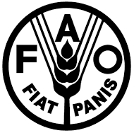

 

        

# Introduction

  

## Coastal Fisheries Initiative 

The Coastal Fisheries Initiative [(CFI)](http://www.fao.org/in-action/coastal-fisheries-initiative/en/) is a global effort to preserve marine resources and ensure that coastal fisheries can continue to play their crucial role in society, contributing to food security, as well as economic and social development. 

Funded by the Global Environment Facility (GEF), the initiative rallies UN agencies and international conservation organizations behind the common goal of promoting the sustainable use and management of coastal fisheries, championing innovative approaches to improve governance and strengthening the seafood value chain. 

CFI provides financial and hands-on technical support to coastal fisheries in six countries across three geographies: Indonesia, Latin America (Ecuador and Peru) and West Africa (Cape Verde, Côte d’Ivoire and Senegal).

 

## Fisheries Performance Assessment Toolkit (FPAT)

To measure the impact of the Coastal Fisheries Initiative (CFI), future performance must be compared to a baseline starting point. The measurement tool chosen by the CFI is the Fisheries Performance Assessment Toolkit (FPAT), developed specifically for monitoring and evaluation of the CFI and built on the notion that an “effective management system is one that is ecologically sustainable, socially acceptable, and generates sustainable resource rents or profits.” (Anderson et al., 2016). 

The FPAT relies on data from a variety of sources ranging from the technical to the informal. This handbook offers a step-by-step guide to collecting the data necessary for completing an assessment using the FPAT, including how to choose data sources, evaluate data quality, and integrate desk research and fieldwork.  

The Fisheries Performance Assessment Toolkit [(FPAT)](https://apps.bluematterscience.com/FPATbeta/) is a browser-based application designed to evaluate the ecological, economic, and social performance of a wide range of fisheries. 

FPAT includes two tools:

1. [Fisheries Performance Indicators](https://www.fpilab.org/): a tool designed to determine how fisheries management systems are performing in order to achieve community, economic, and ecological sustainability.

2. [openMSE](https://openmse.com/): an open-source framework for evaluating the performance of alternative modes of management for a fishery.

 

 

## Fishery Performance Indicators (FPI, University of Washington)

FPIs were developed to facilitate a rapid assessment of the economic, social, and ecological performance of fishery systems around the world. By using the same format to evaluate fisheries ranging from small-scale shellfish fisheries to industrialized, offshore tuna boats, FPIs allow for meaningful comparison between subsets of fisheries (for example, all crab fisheries assessed in less-developed countries) or against a worldwide database of assessed fisheries. Thus, FPIs can be used to evaluate the effectiveness of management interventions, investment, and reforms, and to identify opportunities for triple-bottom line improvements (McCluney et al., 2019).

FPIs utilize published data when available, but also incorporate expert judgement and interviews with key informants to “score” a fishery’s performance against the triple bottom line (ecological, economic, and social). Once research and fieldwork data are collected, FPI [assessments](https://drive.google.com/file/d/1JeJqm31eaMn6TaxV1RMbYU5DtiCMfj4p/view) are created by populating a template in spreadsheet software (e.g., Microsoft Excel). For the CFI FPAT assessments, a Governance Supplement has been added to the standard FPI format to better understand the effect of legal, social, economic, and political arrangements on fisheries management. 

## OpenMSE (Blue Matter Science)

[OpenMSE](www.openmse.com) is an open-source R package for conducting Management Strategy Evaluation (MSE)- a quantitative framework where management options are tested plausible scenarios of fishery dynamics (operating models, states of nature)(Butterworth and Punt 1999). OpenMSE contains component R packages DLMtool [(Carruthers and Hordyk, 2018)](https://besjournals.onlinelibrary.wiley.com/doi/full/10.1111/2041-210X.13081), MSEtool (Hordyk et al. 2021) and SAMtool (Huynh et al. 2021). 

OpenMSE uses data on fisheries biology, economics, and harvesting practices to predict the how alternative management options (e.g. setting harvesting levels above, below, or equal to FMSY ) will affect biological and economic outcomes. The importance of risk assessment  for alternate management strategies has long been recognized (Francis & Shotton 1997), but not operationalized in an accessible framework such as openMSE which provides managers with a powerful tool for identifying species-at-risk, selecting management procedures that can achieve their performance objectives, and calculating stock status. 

# FPAT Input File
The FPAT input file is a specially formatted Excel (.xlsx) workbook, populated with fishery performance indicators and as much fishery data (e.g., catches, estimates of biological parameters) that is available. 

See the [FPAT Data Manual]() for instruction on collecting the fishery data used by FPAT and entering the data into the FPAT input file. 

## Overview of Spreadsheet

## Introduction

# Overview of the FPAT App

## Load the FPAT Input File
The first step in using FPAT is to upload the FPAT input file into the FPAT app. Users also have the option to select from a list of example FPAT case studies.

## Building the Operating Model
Once the FPAT data is loaded, FPAT will attempt to build a Operating Model based on the FPAT fishery data.

A Operating Model is a mathematical model that describes the characteristics of the fishery. FPAT uses the fishery data to re-construct the history of the fishery, including the exploitation pattern (how heavily the stock has been fished over time?) and the trajectory of the stock biomass (what is the current stock biomass relative to its size before fishing?). 

## Examine the Fishery Data
Users can explore the fishery data through a set of plots, including:

- summary of the FPI scores
- predicted fishery dynamics in the operating model
- summary of the stock's biological parameters

## Evaluate Management Options
The Operating Model is used to project the population forward in time and test various alternative management approaches to identify which mode of management (e.g., size limit, spatial closure, or catch limit) is most suitable for maximizing the benefits from the fishery.

Users can select from a wide range of management approaches included in openMSE, or construct their own customized management approach to be evaluated in FPAT.

## Explore Results
The triple-bottom line results can be examined in a series of plots and tables.

More information to be added.

# Additional Material

